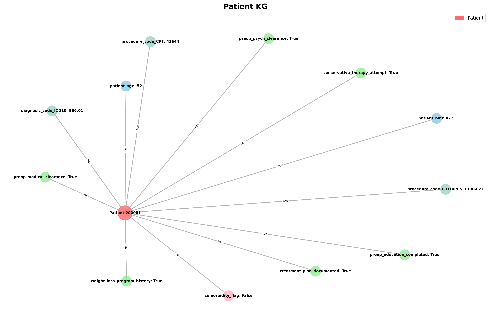
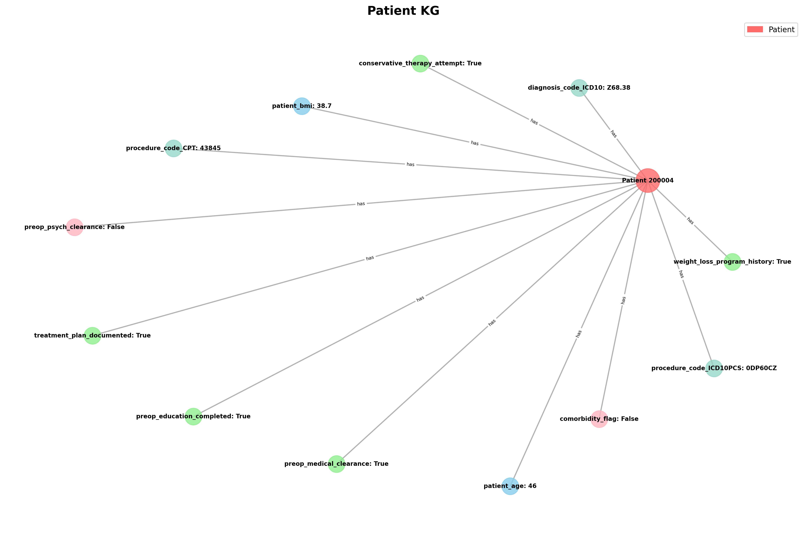
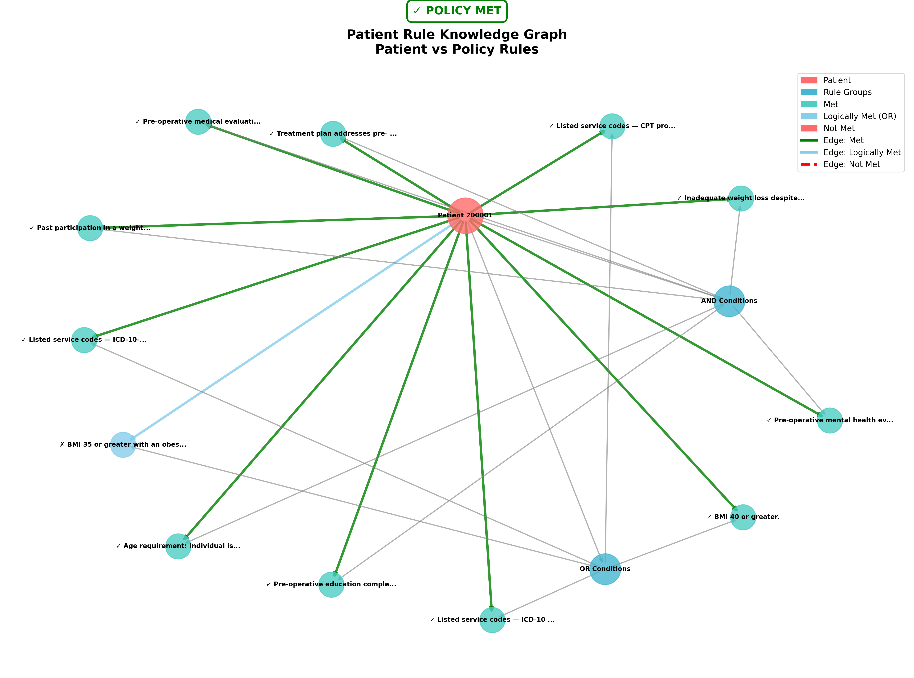
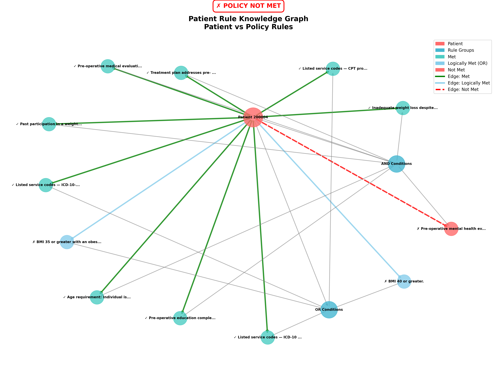

# Medical Policy Knowledge Graph Generator

A Python toolkit for generating and visualizing knowledge graphs from medical policies and patient data. This project focuses on bariatric surgery policies and creates visualizations to understand complex medical decision rules.

## 🚀 Quick Start

1. **Install dependencies:**
```bash
pip install -r requirements.txt
```

2. **Run the complete workflow:**
```bash
# Generate all visualizations for test1 example
chmod +x scripts/generate_all_patient_kgs.sh
chmod +x scripts/generate_all_patient_rule_kgs.sh
chmod +x scripts/plot_policy_rule_kg.sh

./scripts/plot_policy_rule_kg.sh
./scripts/generate_all_patient_kgs.sh
./scripts/generate_all_patient_rule_kgs.sh
```

## 📊 Workflow Overview

The system processes medical policies and patient data through three main phases:

```
Phase 1: Policy Analysis
Input: Policy rules (SQL + Data dictionary)
Output: Policy knowledge graph

Phase 2: Patient Analysis  
Input: Patient data (JSON)
Output: Patient knowledge graph

Phase 3: Compliance Evaluation
Input: Patient data + Policy rules
Output: Compliance report + Visualization
```

## 📁 Project Structure

```
├── patient_kg.py               # Patient data visualizer
├── patient_rule_kg.py          # Patient vs policy evaluator  
├── generate_policy_rule_kg.py  # Policy rule generator
├── test1/                      # Complete example with outputs
│   ├── Patient_data_dictionary/ # Input: Patient JSON files
│   ├── Patient_KG/             # Output: Patient visualizations
│   ├── Patient_Rule_KG/        # Output: Compliance reports
│   └── Policy_CGSURG83/        # Input: Policy data + Output: Policy KG
├── Database/                   # Database management system
└── scripts/                    # Automation scripts
```

## 📋 Example: Bariatric Surgery Analysis (test1/)

The `test1/` directory contains a complete working example analyzing bariatric surgery eligibility.

### Input Data Examples

**Patient 200001 - ELIGIBLE** (`Patient_data_dictionary/Patient_data_dictionary_200001.json`):
```json
{
  "patient_id": "200001",
  "patient_age": 52,
  "patient_bmi": 42.5,
  "comorbidity_flag": false,
  "weight_loss_program_history": true,
  "conservative_therapy_attempt": true,
  "preop_medical_clearance": true,
  "preop_psych_clearance": true,
  "preop_education_completed": true,
  "treatment_plan_documented": true,
  "procedure_code_CPT": "43644",
  "procedure_code_ICD10PCS": "0DV60ZZ",
  "diagnosis_code_ICD10": "E66.01"
}
```

**Patient 200004 - NOT ELIGIBLE** (`Patient_data_dictionary/Patient_data_dictionary_200004.json`):
```json
{
  "patient_id": "200004",
  "patient_age": 46,
  "patient_bmi": 38.7,
  "comorbidity_flag": false,
  "weight_loss_program_history": true,
  "conservative_therapy_attempt": true,
  "preop_medical_clearance": true,
  "preop_psych_clearance": false,
  "preop_education_completed": true,
  "treatment_plan_documented": true,
  "procedure_code_CPT": "43845",
  "procedure_code_ICD10PCS": "0DP60CZ",
  "diagnosis_code_ICD10": "Z68.38"
}
```

**Policy Rules** (`Policy_CGSURG83/SQL_CGSURG83.txt`):
```sql
WHERE patient_age >= 18 
  AND (patient_bmi >= 40.0 OR (patient_bmi >= 35.0 AND comorbidity_flag = TRUE))
  AND weight_loss_program_history = TRUE
  AND conservative_therapy_attempt = TRUE
  AND preop_medical_clearance = TRUE
  AND preop_psych_clearance = TRUE
  AND preop_education_completed = TRUE
  AND treatment_plan_documented = TRUE
```

### Generated Outputs

**1. Policy Knowledge Graph** (`Policy_CGSURG83/policy_rule_kg.png`)
- Visual representation of policy rules
- Hierarchical organization of conditions
- Color-coded by condition type

**2. Patient Knowledge Graphs**

*Patient 200001 (Eligible):*

- Patient data visualization showing all requirements met
- Connected medical conditions and clearances

*Patient 200004 (Not Eligible):*

- Patient data visualization showing missing psychological clearance
- Highlighted areas of non-compliance

**3. Compliance Reports**

*Patient 200001 (Eligible)* (`Patient_Rule_KG/pat_200001_pol_CGSURG83.json`):
```json
{
  "patient_id": "200001",
  "policy_id": "CGSURG83", 
  "patient_met_policy": true,
  "conditions": [
    {
      "condition": "Age requirement: Individual is 18 years or older.",
      "rule": "patient_age >= 18",
      "is_met": true,
      "logical_status": "met"
    },
    {
      "condition": "BMI 40 or greater.",
      "rule": "patient_bmi >= 40.0", 
      "is_met": true,
      "logical_status": "met"
    }
  ]
}
```

*Patient 200004 (Not Eligible)* (`Patient_Rule_KG/pat_200004_pol_CGSURG83.json`):
```json
{
  "patient_id": "200004",
  "policy_id": "CGSURG83",
  "patient_met_policy": false,
  "conditions": [
    {
      "condition": "Age requirement: Individual is 18 years or older.",
      "rule": "patient_age >= 18",
      "is_met": true,
      "logical_status": "met"
    },
    {
      "condition": "BMI 40 or greater.",
      "rule": "patient_bmi >= 40.0",
      "is_met": false,
      "logical_status": "not_met"
    },
    {
      "condition": "BMI 35 or greater with comorbidity.",
      "rule": "patient_bmi >= 35.0 AND comorbidity_flag = TRUE",
      "is_met": false,
      "logical_status": "not_met"
    },
    {
      "condition": "Preoperative psychological clearance required.",
      "rule": "preop_psych_clearance = TRUE",
      "is_met": false,
      "logical_status": "not_met"
    }
  ]
}
```

**4. Compliance Visualizations**

*Patient 200001 (Eligible):*

- Visual compliance dashboard showing all conditions met (green)
- Clear pathway to eligibility

*Patient 200004 (Not Eligible):*

- Visual compliance dashboard showing failed conditions (red)
- Missing psychological clearance and BMI/comorbidity requirements

## 🗄️ Database System

The `Database/` folder provides SQLite-based data management:

**Create Database:**
```bash
python Database/create_database.py --database policy_CGSURG83.db --dictionary test1/Policy_CGSURG83/Data_dictionary_CGSURG83.json
```

**Import Patient Data:**
```bash
python Database/import_data.py --database policy_CGSURG83.db --data-dir test1/Patient_data_dictionary
```

**Run Policy Filters:**
```bash
python Database/run_filter.py --database policy_CGSURG83.db --sql-file test1/Policy_CGSURG83/SQL_CGSURG83.txt --output csv --save patient_data_filtered.csv
```

**Filtered Results** (`Database/patient_data_filtered.csv`):
```csv
patient_id,patient_age,patient_bmi,comorbidity_flag,weight_loss_program_history,conservative_therapy_attempt,preop_medical_clearance,preop_psych_clearance,preop_education_completed,treatment_plan_documented,procedure_code_CPT,procedure_code_ICD10PCS,diagnosis_code_ICD10
200001,52,42.5,0,1,1,1,1,1,1,43644,0DV60ZZ,E66.01
200002,39,36.4,1,1,1,1,1,1,1,43775,0DB60Z3,Z68.36
200005,28,34.8,1,1,1,1,1,1,1,43770,0D160ZA,E66.2
```

## 🔧 Individual Commands

**Generate Policy Knowledge Graph:**
```bash
python generate_policy_rule_kg.py \
  --sql test1/Policy_CGSURG83/SQL_CGSURG83.txt \
  --data-dict test1/Policy_CGSURG83/Data_dictionary_CGSURG83.json \
  --output-dir test1/Policy_CGSURG83
```

**Generate Patient Knowledge Graph:**
```bash
python patient_kg.py \
  test1/Patient_data_dictionary/Patient_data_dictionary_200001.json \
  --output-file test1/Patient_KG/patient_kg_200001
```

**Evaluate Patient Compliance:**
```bash
python patient_rule_kg.py \
  test1/Patient_data_dictionary/Patient_data_dictionary_200001.json \
  test1/Policy_CGSURG83/SQL_CGSURG83.txt \
  test1/Policy_CGSURG83/Policy_CGSURG83.json \
  --policy-id CGSURG83 \
  --output-file test1/Patient_Rule_KG/patient_rule_kg_200001
```

## 📈 Results Summary

The test1 example processes 7 patients against bariatric surgery policy criteria:

### Example Cases:

**Patient 200001 - ELIGIBLE** ✅
- 52 years, BMI 42.5, no comorbidities
- Meets BMI ≥40 requirement
- All clearances completed
- **Result**: All conditions satisfied

**Patient 200004 - NOT ELIGIBLE** ❌
- 46 years, BMI 38.7, no comorbidities  
- Fails BMI ≥40 requirement AND BMI ≥35+comorbidity requirement
- Missing psychological clearance
- **Result**: Multiple conditions not met

### Complete Dataset:
- **Patient 200001**: 52 years, BMI 42.5, **ELIGIBLE** ✅
- **Patient 200002**: 39 years, BMI 36.4 with comorbidities, **ELIGIBLE** ✅  
- **Patient 200003**: Various profile
- **Patient 200004**: 46 years, BMI 38.7, **NOT ELIGIBLE** ❌
- **Patient 200005**: 28 years, BMI 34.8 with comorbidities, **ELIGIBLE** ✅
- **Patient 200006**: Various profile
- **Patient 445789123**: Various profile

All generated visualizations and compliance reports are available in the `test1/` directory for inspection.