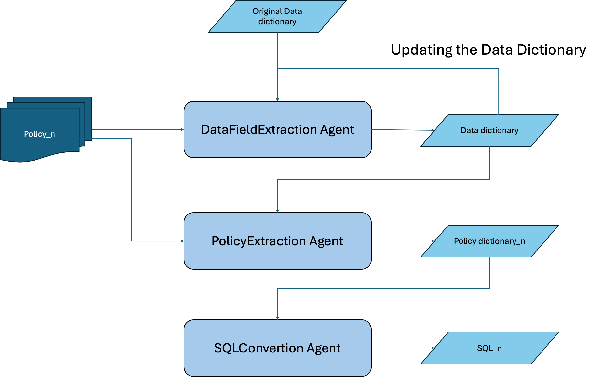
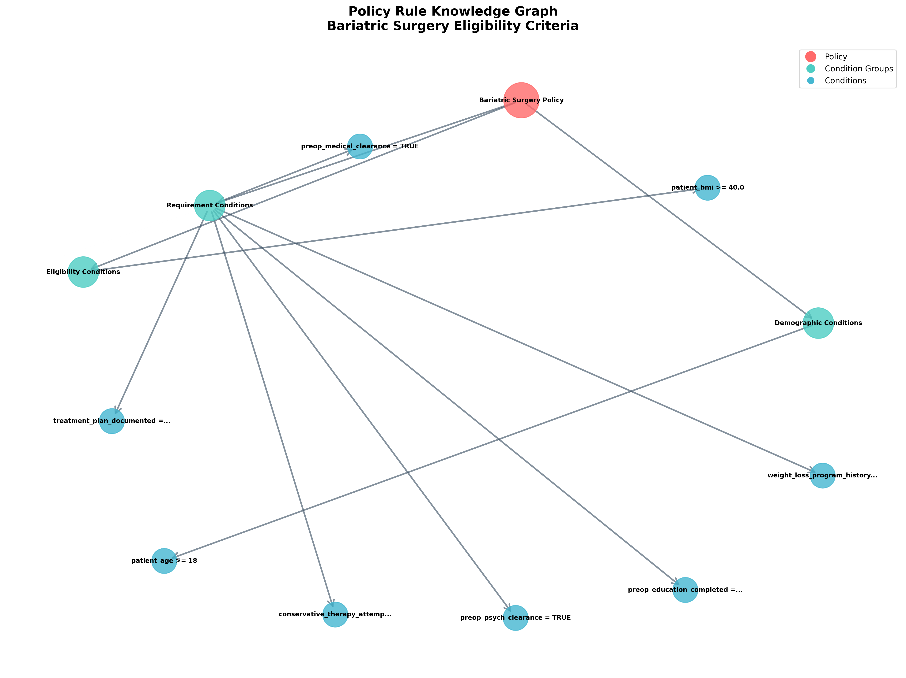
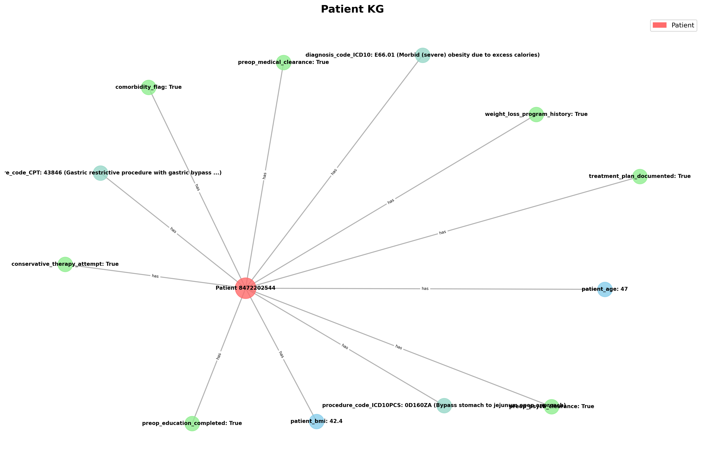
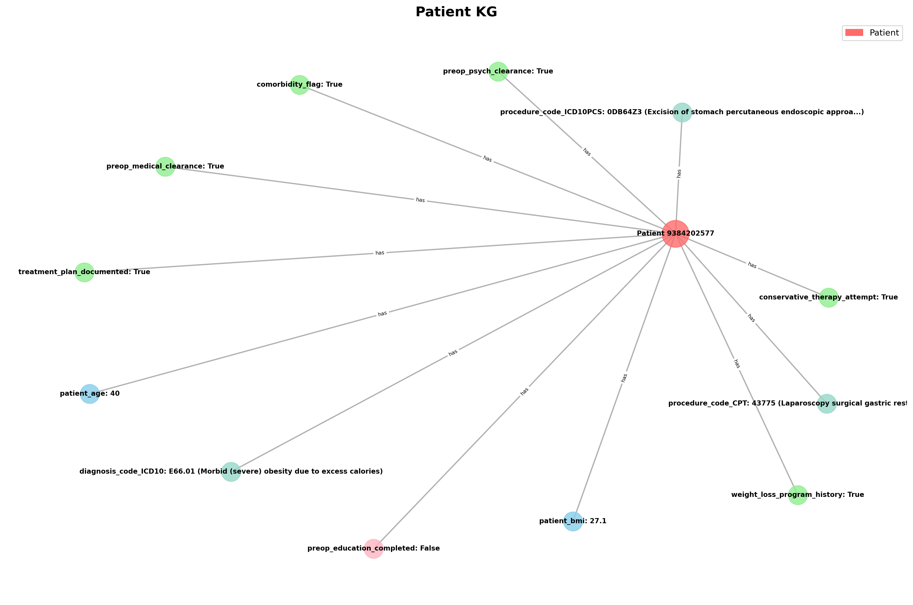
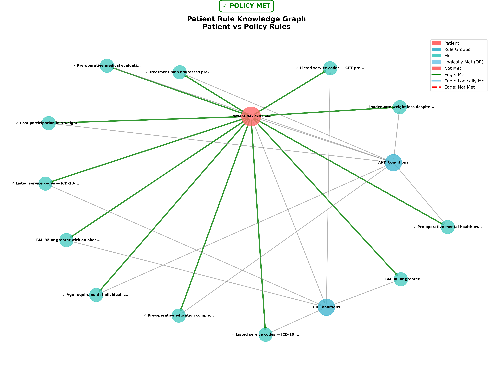
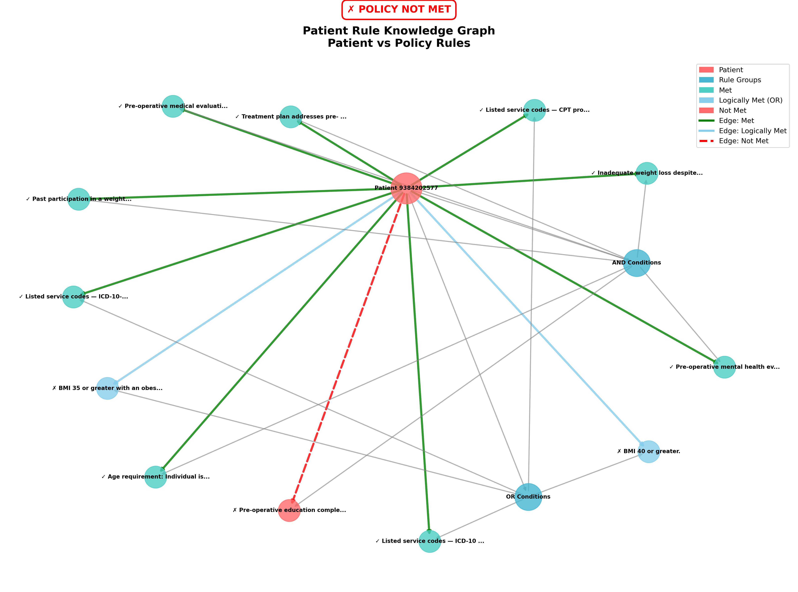
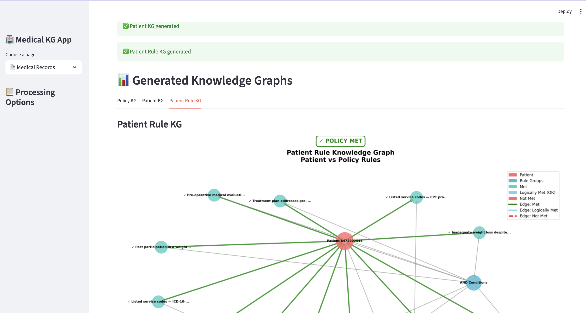
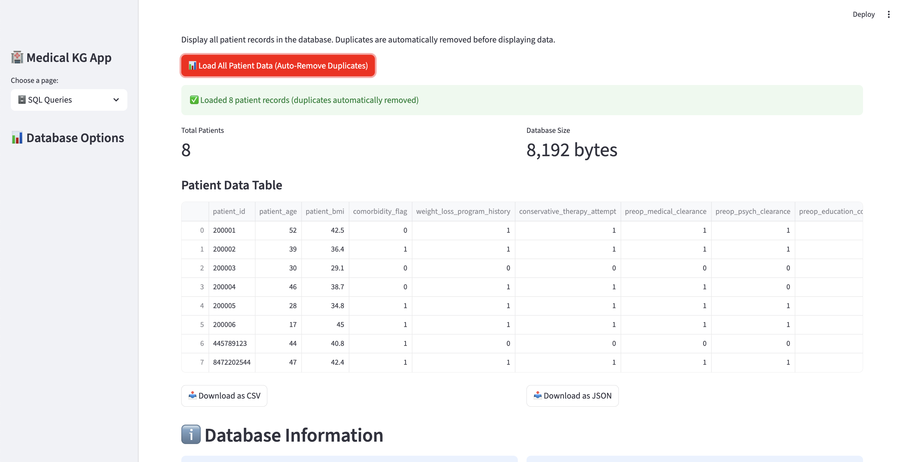

# Medical Policy Knowledge Graph Generator

A Python toolkit for generating and visualizing knowledge graphs from medical policies and patient data. This project focuses on bariatric surgery policies and creates visualizations to understand complex medical decision rules.

## 🚀 Quick Start

1. **Install dependencies:**
```bash
pip install -r requirements.txt
```

2. **Run the Streamlit web app:**
```bash
streamlit run streamlit_app.py
```


## 📁 Project Structure

```
├── patient_kg.py               # Patient data visualizer with code mapping
├── patient_rule_kg.py          # Patient vs policy evaluator  
├── generate_policy_rule_kg.py  # Policy rule generator
├── streamlit_app.py            # Interactive web application
├── Database                    # Database management system
├── OCR                         # Medical record processing
├── patient_data/               # Patient case studies
│   ├── patient_8472202544/     # Patient case 1 (ELIGIBLE)
│   ├── patient_9384202577/     # Patient case 2 (NOT ELIGIBLE)
│   └── patient_*/              # Additional patient cases
├── test1/                      # Complete example with outputs
│   ├── Patient_data_dictionary/ # Input: Patient JSON files
│   ├── Patient_KG/             # Output: Patient visualizations
│   ├── Patient_Rule_KG/        # Output: Compliance reports
│   └── Policy_CGSURG83/        # Input: Policy data + Output: Policy KG
└── scripts/                    # Automation scripts
```


## 📋 Policy Rule Extraction: Bariatric Surgery
### Policy Extraction Agents Workflow



The [`/test1`](test1) directory contains a complete working example analyzing bariatric surgery eligibility.


### 1. Data Field Extraction Agent
#### Input
1. **Bariatric Surgery Policy**: https://www.anthem.com/medpolicies/abc/active/gl_pw_d085821.html
2. [**Initial Data Dictionary**](test1/Data_dictionary.json): 
```json
[
    {
      "name": "patient_id",
      "type": "string",
      "description": "Unique patient identifier",
      "section": "Demographics"
    }
]
```
#### Output
1. **Data Dictionary JSON**: [Data_dictionary_CGSURG83.json](https://github.com/sijiasiga/Capstone_KG_VoiceAgents/blob/main/KG/test1/Policy_CGSURG83/Data_dictionary_CGSURG83.json)

### 2. Policy Extraction Agent
#### Input
1. **Bariatric Surgery Policy**: https://www.anthem.com/medpolicies/abc/active/gl_pw_d085821.html
2. **Data Dictionary JSON**: [Data_dictionary_CGSURG83.json](https://github.com/sijiasiga/Capstone_KG_VoiceAgents/blob/main/KG/test1/Policy_CGSURG83/Data_dictionary_CGSURG83.json)

#### Output
1. **Policy Condition JSON**: [Policy_CGSURG83.json](https://github.com/sijiasiga/Capstone_KG_VoiceAgents/blob/main/KG/test1/Policy_CGSURG83/Policy_CGSURG83.json)

### 3. SQL Convertion Agent
#### Input
1. **Policy Condition JSON**: [Policy_CGSURG83.json](https://github.com/sijiasiga/Capstone_KG_VoiceAgents/blob/main/KG/test1/Policy_CGSURG83/Policy_CGSURG83.json)

#### Output
1. **SQL**: [Policy_CGSURG83.json](https://github.com/sijiasiga/Capstone_KG_VoiceAgents/blob/main/KG/test1/Policy_CGSURG83/SQL_CGSURG83.txt)
```sql
WHERE patient_age >= 18 
  AND (patient_bmi >= 40.0 OR (patient_bmi >= 35.0 AND comorbidity_flag = TRUE))
  AND weight_loss_program_history = TRUE
  AND conservative_therapy_attempt = TRUE
  AND preop_medical_clearance = TRUE
  AND preop_psych_clearance = TRUE
  AND preop_education_completed = TRUE
  AND treatment_plan_documented = TRUE
```


## 📊 Patient-Policy Compliance

The system processes medical policies and patient data through three main phases:

```
Phase 1: Policy Analysis
Input: Policy rules (policy json)
Output: Policy knowledge graph

Phase 2: Patient Analysis  
Input: Patient data (patient record json)
Output: Patient knowledge graph

Phase 3: Compliance Evaluation
Input: Patient data + Policy rules
Output: Compliance report + Visualization
```


### Generated Outputs

**1. Policy Knowledge Graph** (`Policy_CGSURG83/policy_rule_kg.png`)


**2. Patient Knowledge Graphs**

### ✅ Patient 8472202544 - ELIGIBLE

[PDF](patient_data/patient_8472202544/MR_2.pdf)--[OCR](OCR/pdf_ocr.py)--[Parser](OCR/medical_record_parser.py)-->[JSON](patient_data/patient_8472202544/Patient_data_dictionary_8472202544.json)
```json
{
  "patient_id": "8472202544",
  "patient_age": 47,
  "patient_bmi": 42.4,
  "comorbidity_flag": true,
  "weight_loss_program_history": true,
  "conservative_therapy_attempt": true,
  "preop_medical_clearance": true,
  "preop_psych_clearance": true,
  "preop_education_completed": true,
  "treatment_plan_documented": true,
  "procedure_code_CPT": "43846",
  "procedure_code_ICD10PCS": "0D160ZA",
  "diagnosis_code_ICD10": "E66.01"
}
```



### ❌ Patient 9384202577 - NOT ELIGIBLE

[PDF](patient_data/patient_9384202577/MR_3.pdf)--[OCR](OCR/pdf_ocr.py)--[Parser](OCR/medical_record_parser.py)-->[JSON](patient_data/patient_9384202577/Patient_data_dictionary_9384202577.json)
```json
{
  "patient_id": "9384202577",
  "patient_age": 40,
  "patient_bmi": 27.1,
  "comorbidity_flag": true,
  "weight_loss_program_history": true,
  "conservative_therapy_attempt": true,
  "preop_medical_clearance": true,
  "preop_psych_clearance": true,
  "preop_education_completed": false,
  "treatment_plan_documented": true,
  "procedure_code_CPT": "43775",
  "procedure_code_ICD10PCS": "0DB64Z3",
  "diagnosis_code_ICD10": "E66.01"
}
```



**3. Compliance Reports**

### ✅ Patient 8472202544 - ELIGIBLE

**Visualization:**


**Compliance Report** (`patient_data/patient_8472202544/pat_8472202544_pol_CGSURG83.json`):
```json
{
  "patient_id": "8472202544",
  "policy_id": "CGSURG83", 
  "patient_met_policy": true,
  "conditions": [
    {
      "condition": "Age requirement: Individual is 18 years or older.",
      "rule": "patient_age >= 18",
      "logic": "AND",
      "is_met": true,
      "logically_met": true,
      "logical_status": "met"
    },
    {
      "condition": "BMI 40 or greater.",
      "rule": "patient_bmi >= 40.0",
      "logic": "OR",
      "is_met": true,
      "logically_met": true,
      "logical_status": "met"
    }
  ]
}
```

### ❌ Patient 9384202577 - NOT ELIGIBLE

**Visualization:**


**Compliance Report** (`patient_data/patient_9384202577/pat_9384202577_pol_CGSURG83.json`):
```json
{
  "patient_id": "9384202577",
  "policy_id": "CGSURG83",
  "patient_met_policy": false,
  "conditions": [
    {
      "condition": "Age requirement: Individual is 18 years or older.",
      "rule": "patient_age >= 18",
      "logic": "AND",
      "is_met": true,
      "logically_met": true,
      "logical_status": "met"
    },
    {
      "condition": "BMI 40 or greater.",
      "rule": "patient_bmi >= 40.0",
      "logic": "OR",
      "is_met": false,
      "logically_met": true,
      "logical_status": "logically_met_by_other_or"
    },
    {
      "condition": "Pre-operative education completed (risks, benefits, expectations, need for long-term follow-up, adherence to behavioral modifications).",
      "rule": "preop_education_completed = TRUE",
      "logic": "AND",
      "is_met": false,
      "logically_met": false,
      "logical_status": "not_met"
    }
  ]
}
```


## 🌐 Streamlit Web Application

The `streamlit_app.py` provides an interactive web interface for the complete workflow:

### Features:
- **📄 Medical Records Page**: Upload PDFs, extract text, parse patient data, generate knowledge graphs
- **🗄️ SQL Queries Page**: View database, run policy filters, manage patient records


### Usage:
```bash
streamlit run streamlit_app.py
```

### Screenshots:

**Medical Records Processing Page:**


**SQL Queries & Database Management Page:**
